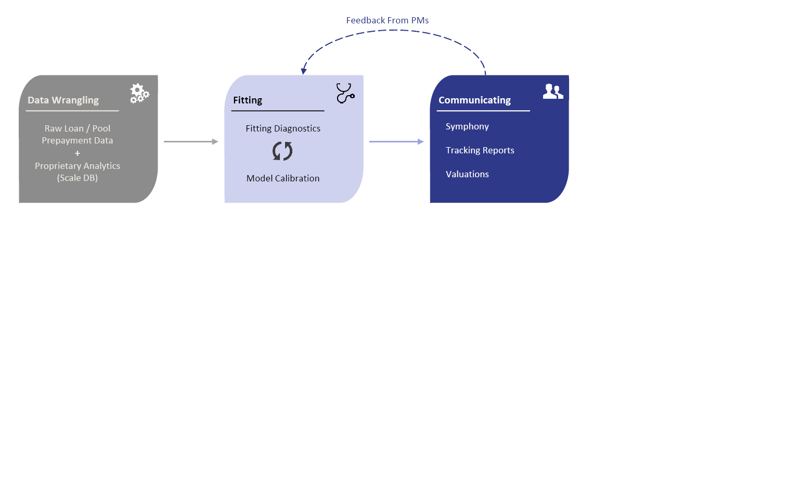

# Introduction

The life-cycle of a mortgage can be conceptualized as consisting of various **payment states** (**Current**, **30-days Delinquent**, **60-Days Delinquent** etc) with various possible paths to get from one state to another. **Loan-level** prepayment models typically explicitly model the transition between different payment states as a function of various explanatory variables ranging from macro-economic time series to borrower-level attributes. A **pool-level** model can be regarded as a simplified loan-level model that attempts to predict the behavior of mortgage loans at an aggregate level, i.e., by grouping them. Grouping or pooling loans means that we no longer have the ability to track changes in payment status except for *terminal* ones -- the transition from "Current" to "Prepayment" or the transition from "Deliquent" to "Prepayment". The upshot is that pool-level models are specified and estimated somewhat differently than loan-level models.

Given a collection of loans backing an MBS, \textbf{stratification} is the process of dividing members of this collection into homogeneous and mutually exclusive subgroups. Each subgroup can then be appropriately modeled as a single ``average'' loan called a \textbf{repline} that can be considered a representative of this subgroup. The idea behind repline creation is the reduction in dimensionality. For example, 1 million loans can be reduced to 1,000 replines which is much more tractable from a computational perspective when predicting prepayments.

Replines can be implemented in several different ways. For example, in our current production system, we have: (1) \textbf{Single replines} that correspond to a simple loan-level weighted average; (2) \textbf{Pool-level replines} that stratify a CMO into a number of subgroups based on pool-level data; and (3) \textbf{Loan-level replines} that do the same as (2) but use loan-level data. In effect, we get increasing granularity but also increasing use of computational resources as we move from (1) to (3).

The `batonutil` R package aims to create a one-stop platform for specifying, estimating and tracking an agency pool-level prepayment model. It follows a data science paradigm [@Wickham2017] by breaking down the modeling workflow as per the following figure:



Let's go through these blocks one by one:

1. **Data Wrangling**: This involves getting the ``raw" prepayment data set into a useful form for visualization and modeling. There are three parts to this:

     + **Import**: This reads in data from a flat file (typically a .csv) into R. The key function is `imprtr`.
     + **Tidy**: This is a consistent way of storing data that makes it easier to transform, visualize and model.^[See \url{http://r4ds.had.co.nz/tidy-data.html}.] It also handles missing values. The key function is `tidyr`. 
     + **Transform**: This function creates new variables in order to make the data a little easier to work with or to perhaps add additional model covariates that can be expressed as functions of some of the inputs. The key function is `tfrmr`.
         
2. **Fitting**: A model is specified and estimated in this step. Often, several iterations can be involved as specifications are tweaked and parameters are assessed for their reasonableness. The key functions here are `estimatr` and `trackr`.

3. **Communicating**: The model and its tracking results are deployed and made available through the Symphony application to Portfolio Managers (PMs). By assessing model tracking results for individual bonds and through generating hedge ratios, Durations and Convexities for benchmark liquid MBS such as TBAs and IOs, PMs communicate problem areas for the current prepayment model.

The idea behind "institutionalizing" this workflow is to enforce a consistent framework for our various prepayment modeling efforts. This consistency makes it easier to organize, share, check errors, and innovate. The workflow is captured in `main.R`:

```{r, echo=TRUE, eval=FALSE}
  # Step 0: Set up Global Variables
  source("R/config.R")
  
  # Step 1: Import prepayment data into R from flat file
  ppdata.imp <- imprtr()
  
  # Step 2: Tidy R data (see source file for definition of 'tidy')
  ppdata.td <- tidyr(coll=pkg.env$coll, ppdata=ppdata.imp)
  
  # Step 3: Transform R data (add any new columns if necessary); filter data if necessary
  ppdata.tf <- tfrmr(coll=pkg.env$coll, submodel=pkg.env$submodel, 
                     gnmaProgram=pkg.env$gnmaProgram, ppdata=ppdata.td)

  # Step 4: Estimate submodel
  # This step is optional. One can go directly to Step 5 for a more manual, 
  # iterative & visual fitting process.

  # 4.1: Find variables corresponding to best linear model
  bestModelsInfo <- selectr(coll=pkg.env$coll, ppdata=ppdata.tf)
  cat("Best variables for model: ", bestModels$bestVariables, "\n")
  
  # 4.2: Automated estimation of spline-based model
  mdl <- estimatr(coll=pkg.env$coll, submodel=pkg.env$submodel, 
                  gnmaProgram=pkg.env$gnmaProgram, 
                  extparamsFitted = pkg.env$extparamsFitted, ppdata = ppdata.tf) 
  ppdata <- mdl$ppdata
  
  # Step 5: Tracking
  # Use filters to track on specific subsets of the data
  ppdata.sub <- ppdata.tf %>% dplyr::filter(   (ppdata.tf$bal >  pkg.env$minBal)) 
                                          
  ppdata.fin <- trackr(coll = pkg.env$coll, submodel = pkg.env$submodel, 
                       gnmaProgram = pkg.env$gnmaProgram, ppdata = ppdata.sub,
                       bucketSize = pkg.env$bucketSize)
```

In practice, the initial csv file is produced using a SQL query on a loan/pool database. "Tidying" the data turns out to be more convenient in SQL (or Python) for example in tasks such as filling in NA values with an imputation algorithm for millions of rows. Consequently, the `tidyr` is currently more or less a placeholder to handle legacy data sets that have not been fully "tidied" before being imported into R.

# Data Sets
monthsSince is defined as follows. Fix an asof date and a pool that is 100% current for that date. We create a time series for that pool that corresponds to its default rates for every asof date succeeding that date. monthsSince increments by one for each such date. Now move to asofdate + 1 month. If the pool is still 100% current, repeat the process above to come up with another time series of default rates and monthsSince values. Thus, each pool creates multiple time-series. The rationale for this setup is to get a sense for the baseline default rates produced by pools that we know to initially be 100% current.
****

Some thoughts:
It seems like the definition makes sense for a loan that is current
What is the corresponding notion for a loan that is delinquent? It seems like the definition still makes sense -- once a loan is delinquent it goes through a path that may end in default but also may end in cure. Obviously, default is much more likely than in the current case.
So, the monthsSince variable is basically defining a seasoning ramp for the loan depending on some initial state (current, delinquent).

Default fitting strategy is somewhat special:
For tracking, we usually aggregate by asofdate. When fitting, we want to look by monthsSince which doesn't necessarily map in a clean way to asofdate.

I recall the MDR column is only available for GNM loan level data We have a removalReasonType for GNM loans but not for others. So Conventional default modeling has to look at pool-level data.

# Philosophical comments on fitting

Fitting to the right data set is crucial especially when you're thinking about prediction.

I guess the question at some point becomes trading off the model's predictive power versus its interpretability/transparency.
I also wanted to respond to your comments about choosing "average" versus post- and pre-HARP fits. What you're saying only works assuming that whenever we sample a time period we get a full range of economic environments. For instance, what's to stop us from just fitting to 2016-2017 data? The point is that we sample a much more limited range of environments (media effect, credit availability, ..) and therefore whenever we encounter a "new" environment the model projections presumably have much less confidence than if your fits already incorporated instances of this environment. 
Hence, apart from the fact that borrowers are changing over time, we also need to account for that fact that more time = a greater range of environments to see how borrowers respond. One of the reasons that picking pre-2007 data is important is that otherwise we have very limited information about how mortgage refi in a high credit availability environment. Of course, if we're just interested in purely local behavior then this is not a concern. Time is implicitly a variable in the prepayment model since we determine what time span the data set belongs to.
# References

